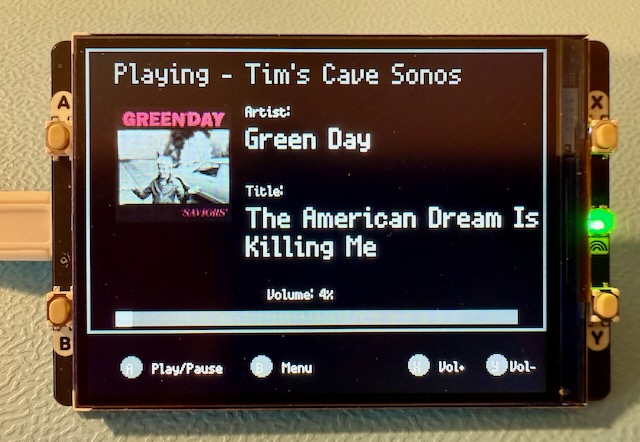
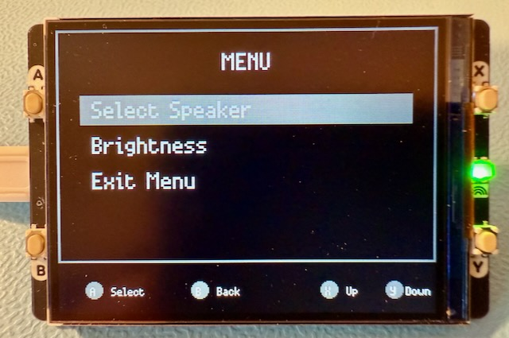
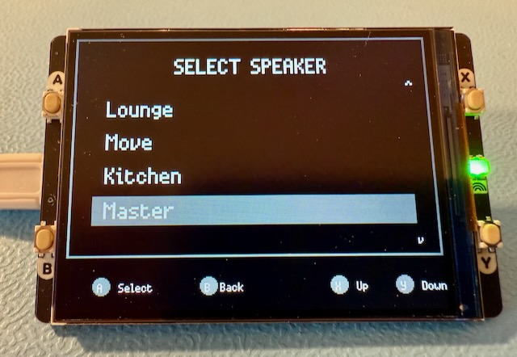
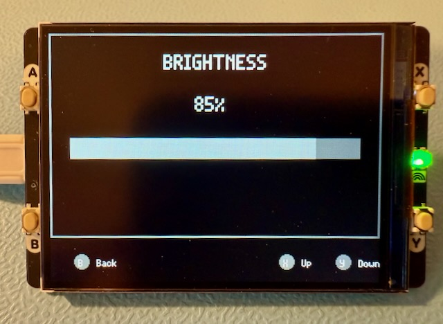

# Home Assistant Sonos Remote Control with Display

A MicroPython application for controlling Sonos speakers via Home Assistant using a Pimoroni Pico Display Pack 2 and a Raspberry Pi Pico 2 W.



## Features

- WiFi connectivity status
- Speaker selection
- Play/Pause control
- Skip to next or previous track
- Volume control
- Album art display
- Brightness control
- Sleep mode with wake on button press

## Screenshots

### Main Playback Screen


### Menu


### Speaker Selection


### Brightness Control


## Hardware Requirements

- Raspberry Pi Pico W
- Pimoroni Pico Display Pack 2

## Setup

1. Copy `main.py`, `LICENCE.txt`, and your `config.py` to your Pico W, which needs to be running Pimoroni MicroPython https://github.com/pimoroni/pimoroni-pico-rp2350/releases or have the Pimoroni Pico Display Pack libraries installed on vanilla MicroPython.
2. Create a `config.py` file on the Pico W based on `config_example.py`, filling in your WiFi credentials and Home Assistant details:
   ```python
   WIFI_SSID = "your_wifi_ssid"
   WIFI_PASSWORD = "your_wifi_password"
   HA_URL = "http://your_home_assistant_ip:8123"
   HA_TOKEN = "your_long_lived_access_token"
   ```
   A long-lived access token can be created in Home Assistant under your profile → Security → Long-lived access tokens.
3. Ensure Home Assistant has the Sonos integration installed and properly configured.
4. Reset the Pico W to start the application.

## Usage

- Button A: Short press: Play/Pause (or Select in menu), Long press: Next Track
- Button B: Short press: Menu/Back, Long press: Previous Track
- Button X: Volume Up / Menu Up
- Button Y: Volume Down / Menu Down

## Configuration

Several constants near the top of `main.py` can be adjusted to tune behaviour:

| Constant | Default | Description |
|---|---|---|
| `SCREEN_SLEEP_TIMEOUT` | `60` | Seconds of inactivity before blanking the screen (WiFi stays on, instant wake) |
| `DEEP_SLEEP_TIMEOUT` | `3600` | Seconds of inactivity before deep sleep (WiFi off, ~3-5s reconnect on wake) |
| `MIN_BRIGHTNESS` | `0.25` | Minimum brightness (0.0–1.0) reachable via the Brightness menu |

### Two-tier sleep

The device uses a two-tier sleep model:

1. **Screen sleep** (after `SCREEN_SLEEP_TIMEOUT` seconds of inactivity): the display is turned off and the LED blinks green with a fast cadence (1 s on / 1 s off). WiFi stays connected and the device continues polling Home Assistant in the background. Any button press wakes the screen instantly with up-to-date playback information — no reconnect delay.

2. **Deep sleep** (after `DEEP_SLEEP_TIMEOUT` seconds of total inactivity): the CYW43 WiFi chip is deactivated (`wlan.active(False)`) and the CPU is lowered to 48 MHz. The LED blinks green with a slow cadence (2 s on / 2 s off) to distinguish it from screen sleep. This prevents the SDIO transport stall (`F2 not ready` / `STALL` errors) that occurs when the chip remains powered but idle for extended periods. Waking from deep sleep requires a full WiFi reconnect (~3–5 seconds), but the cached playback state is shown on screen immediately.

When the device is awake the LED is solid green.

## License

This project is licensed under a custom non-commercial license. See the LICENSE file for details.
Key points:
- Free for non-commercial use
- Commercial use requires explicit permission
- Attribution required when sharing or modifying
- No warranty provided

## Author

Tim Hanley