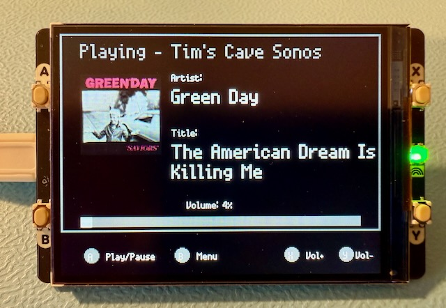
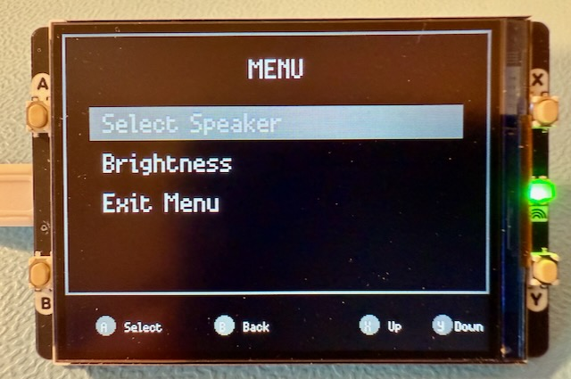
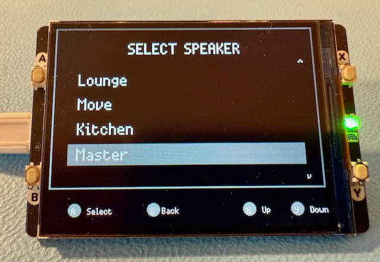
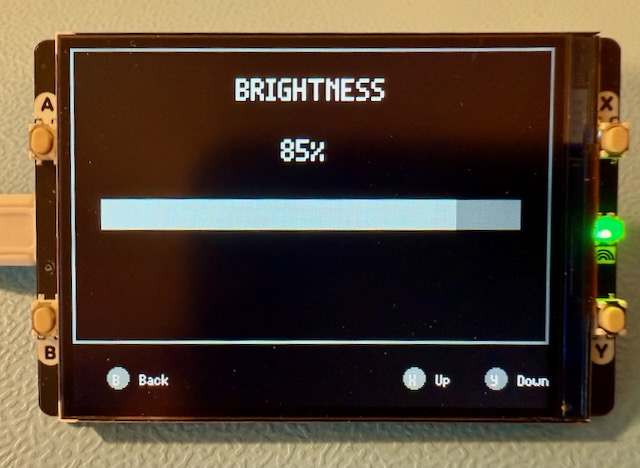

# Home Assistant Sonos Remote Control with Display

A MicroPython application for controlling Sonos speakers via Home Assistant using a Pimoroni Pico Display Pack 2 and a Raspberry Pi Pico 2 W.

**Version 2.0.0** — a full modular rewrite of the original single-file application. Same functionality, restructured for efficiency and maintainability.



## Features

- WiFi connectivity status
- Speaker selection
- Play/Pause control
- Skip to next or previous track
- Volume control
- Album art display (PNG and JPEG, auto-detected)
- Brightness control
- Two-tier sleep mode with wake on button press

## Screenshots

### Main Playback Screen


### Menu


### Speaker Selection


### Brightness Control


## Hardware Requirements

- Raspberry Pi Pico 2 W
- Pimoroni Pico Display Pack 2 (2.8", 320×240)

The Pico needs to be running [Pimoroni MicroPython](https://github.com/pimoroni/pimoroni-pico-rp2350/releases), or vanilla MicroPython with the Pimoroni Pico Display Pack libraries installed.

## Project Structure

```
main.py            Entry point
config.py          Your credentials + optional tunables (gitignored)
app/
  app.py           Application core: state, tasks, main loop
  screens.py       Playback / Menu / SpeakerSelect / Brightness screens
  buttons.py       Core 1 button polling + event queue
  power.py         Two-tier sleep manager
  artwork.py       Album art pipeline (download → decode → pixel cache)
  pngthumb.py      Streaming PNG thumbnail decoder
  pngfilters_viper.py  Viper-accelerated PNG primitives (device fast path)
  pngfilters.py    Pure-Python PNG primitives (reference + fallback)
  ha.py            Home Assistant REST client
  hapush.py        Push state updates via HA's WebSocket API
  wsclient.py      Minimal WebSocket client (RFC 6455)
  httpc.py         Minimal async HTTP client
  net.py           WiFi connection manager
  hw.py            Display, pens, LED, buttons, display lock
  settings.py      Config defaults
  log.py           Console logging
  textutil.py      Pure text helpers
```

## Setup

1. Create a `config.py` based on `config_example.py`, filling in your WiFi credentials and Home Assistant details:
   ```python
   WIFI_SSID = "your_wifi_ssid"
   WIFI_PASSWORD = "your_wifi_password"
   HA_URL = "http://your_home_assistant_ip:8123"
   HA_TOKEN = "your_long_lived_access_token"
   ```
   A long-lived access token can be created in Home Assistant under your profile → Security → Long-lived access tokens.
2. Copy `main.py`, the `app/` directory, and your `config.py` to the Pico. With [mpremote](https://docs.micropython.org/en/latest/reference/mpremote.html) installed:
   ```
   make deploy            # or: mpremote connect auto cp main.py :main.py + cp -r app :
   mpremote cp config.py :config.py
   ```
   (Close Thonny or any other serial connection first — it holds the port.)

   Alternatively, `make deploy-mpy` deploys precompiled `.mpy` bytecode instead of source — faster boot and less heap fragmentation, since the device skips compiling ~90 KB of Python. It requires `mpy-cross` matching the firmware's MicroPython version (`pip install mpy-cross==<version>.*`); don't mix it with `make deploy` on the same device without redeploying fully, as it clears `:app` first to avoid stale files.
3. Ensure Home Assistant has the Sonos integration installed and configured.
4. Reset the Pico to start the application (`make reset`).

## Usage

- Button A: Short press: Play/Pause (or Select in menu), Long press: Next Track
- Button B: Short press: Menu/Back, Long press: Previous Track
- Button X: Volume Up / Menu Up
- Button Y: Volume Down / Menu Down

## Configuration

All tunables are optional entries in `config.py` (see `config_example.py`) — no code edits needed:

| Setting | Default | Description |
|---|---|---|
| `POLL_INTERVAL` | `1.0` | Seconds between Home Assistant state polls |
| `SCREEN_SLEEP_TIMEOUT` | `60` | Seconds of inactivity before blanking the screen (WiFi stays on, instant wake) |
| `DEEP_SLEEP_TIMEOUT` | `3600` | Seconds of inactivity before deep sleep (WiFi off, ~3-5s reconnect on wake) |
| `MIN_BRIGHTNESS` | `0.25` | Minimum brightness (0.0–1.0) reachable via the Brightness menu |
| `DEFAULT_BRIGHTNESS` | `1.0` | Brightness before any saved setting exists |
| `HTTP_TIMEOUT` | `10` | Seconds allowed per HTTP operation |
| `USE_WEBSOCKET` | `True` | Push updates via HA's WebSocket API; `False` for REST polling only |
| `DEBUG` | `False` | Verbose logging on the USB console |

### Two-tier sleep

1. **Screen sleep** (after `SCREEN_SLEEP_TIMEOUT` seconds of inactivity): the display turns off and the LED blinks green with a fast cadence (1 s on / 1 s off). WiFi stays connected and polling continues in the background. Any button press wakes the screen instantly with up-to-date playback information.

2. **Deep sleep** (after `DEEP_SLEEP_TIMEOUT` seconds of total inactivity): the CYW43 WiFi chip is deactivated and the CPU is lowered to 48 MHz. The LED blinks green with a slow cadence (2 s on / 2 s off). This prevents the SDIO transport stall (`F2 not ready` / `STALL`) that occurs when the chip stays powered but idle for long periods. Waking requires a full WiFi reconnect (~3–5 seconds); cached playback state is shown immediately.

When the device is awake the LED is solid green.

## Architecture Notes

- **Core 0** runs the asyncio event loop: the main action loop, a state task, a WiFi check task, and ad-hoc album art tasks. **Core 1** polls the buttons every 5 ms, paints instant press feedback, and queues events for Core 0 via a `ThreadSafeFlag`.
- State updates arrive by **push**: one WebSocket subscription (`subscribe_entities`) covers every discovered speaker, so track changes appear in well under a second, switching speakers is instant, and idle network traffic is near zero. Only the seven display-relevant fields are kept per speaker. If the socket drops, the app falls back to REST polling of HA's `/api/template` endpoint (~200 bytes/poll) and periodically retries the socket; `USE_WEBSOCKET = False` forces polling mode permanently.
- Album art (PNG or JPEG, detected by magic bytes) is decoded once into an 80×80 RGB565 pixel cache; redraws are a pure framebuffer copy. PNGs are downscaled with a custom streaming box-averaging decoder, since the stock `pngdec` cannot downscale.
- A `display_lock` protects every framebuffer-build → `display.update()` sequence across both cores.

## Development

```
make test       # CPython unit tests + MicroPython suite (if installed)
make test-mpy   # app modules under real MicroPython (unix port, stubbed hardware)
make test-live  # read-only network check against your real HA (home LAN only)
make lint       # ruff
make deploy     # copy code to the device
make deploy-mpy # precompiled .mpy deploy (needs mpy-cross matching the firmware)
make console    # serial REPL
```

The MicroPython suite (`tests/mpy/run_tests.py`, `brew install micropython`)
runs the actual app modules under the real MicroPython interpreter with
stubbed hardware — it catches MicroPython-specific breakage before flashing.
CI runs lint plus both suites on every push. `TESTING.md` documents the
on-hardware test pass required before a release is trusted.

## License

This project is licensed under a custom non-commercial license. See the LICENSE file for details.
Key points:
- Free for non-commercial use
- Commercial use requires explicit permission
- Attribution required when sharing or modifying
- No warranty provided

## Author

Tim Hanley
