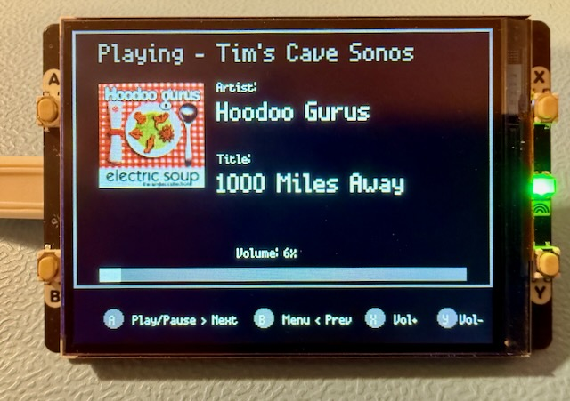

# Home Assistant Sonos Remote Control with Display

A MicroPython application for controlling Sonos speakers via Home Assistant using a Pimoroni Pico Display Pack 2 and a Raspberry Pi Pico 2 W.

## Features

- WiFi connectivity status
- Speaker selection
- Play/Pause control
- Skip to next or previous track
- Volume control
- Album art display
- Brightness control
- Sleep mode with wake on button press

## Screenshots

### Main Playback Screen

### Menu

### Speaker Selection

### Brightness Control

## Hardware Requirements

- Raspberry Pi Pico W
- Pimoroni Pico Display Pack 2

## Setup

1. Copy main.py and the LICENCE.txt file to your Pico W which needs to be running Pimoroni micropython https://github.com/pimoroni/pimoroni-pico-rp2350/releases or install the Pimoroni pico display pack libraries on vanilla micropython.   
2. Update the WiFi and Home Assistant configuration near the top of main.py
3. Ensure Home Assistant has the Sonos integration installed and properly configured
4. Reset the Pico W to start the application

## Usage

- Button A: Short press: Play/Pause (or Select in menu), Long press: Next Track
- Button B: Short press: Menu/Back, Long press: Previous Track
- Button X: Volume Up / Menu Up
- Button Y: Volume Down / Menu Down

## License

This project is licensed under a custom non-commercial license. See the LICENSE file for details.
Key points:
- Free for non-commercial use
- Commercial use requires explicit permission
- Attribution required when sharing or modifying
- No warranty provided

## Author

Tim Hanley